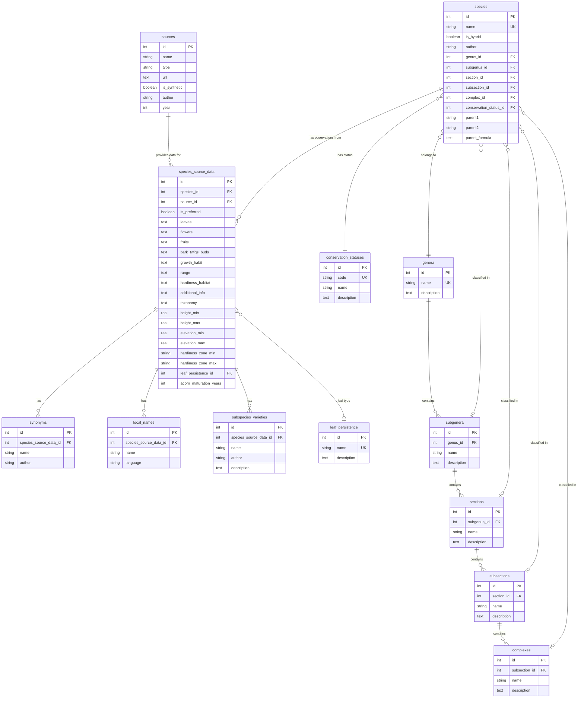

# Quercus Database Schema

## Overview

The Quercus database uses a **source-attributed data model** where:
- **Species** and **taxonomy** are opinionated facts we curate
- **Observational data** (morphology, range, etc.) is attributed to specific sources
- Sources can be marked as **preferred** for each species
- A **synthetic source** represents our curated/reconciled data

## High-Level Schema

## Table Descriptions

### Core Tables

#### `species`
Core species facts that are opinionated/curated:
- Species identity (name, author)
- Hybrid status and parentage
- Conservation status
- Taxonomic classification (genus required, other ranks optional)

#### `sources`
Reference sources for all observational data:
- Websites, journal articles, books, personal observations
- Special case: `is_synthetic=true` for our curated/reconciled source
- Contains bibliographic metadata

#### `species_source_data`
The heart of the source-attribution model. For each (species, source) pair:
- Morphological observations (text fields always preserved)
- Source-reported taxonomy (free text)
- Extracted structured data for querying (heights, elevations, zones)
- `is_preferred` flag to mark preferred source for a species

### Related Data (Source-Attributed)

All of these tables link to `species_source_data`, meaning they are source-attributed:

- **`synonyms`**: Alternative scientific names with authorities
- **`local_names`**: Common names in various languages
- **`subspecies_varieties`**: Infraspecific taxa

### Controlled Vocabularies

- **`conservation_statuses`**: IUCN Red List categories (EX, EW, CR, EN, VU, NT, LC, DD, NE)
- **`leaf_persistence`**: Deciduous, evergreen, semi-evergreen

### Taxonomy Tables

Our opinionated/curated taxonomic hierarchy for oak species:

**Hierarchy:** `Genus` → `Subgenus` → `Section` → `Subsection` → `Complex`

- **`genera`**: Top-level genus (e.g., Quercus). Future-proofs for related genera.
- **`subgenera`**: Division within genus (e.g., Quercus, Cerris, Cyclobalanopsis)
- **`sections`**: Major taxonomic division (e.g., Lobatae, Quercus, Ilex)
- **`subsections`**: Subdivision of sections (e.g., Coccineae, Dumosae, Albae)
- **`complexes`**: Informal species groupings (e.g., "Q. shumardii complex")

Each rank is optional except genus. Species can be assigned to any appropriate level.

**Dual Taxonomy Approach:**
1. **Curated taxonomy** (species table FKs): Our opinionated global classification
2. **Source-reported taxonomy** (species_source_data.taxonomy field): What each source says (free text)

## Design Decisions

### Text Preservation
All free-text fields from sources are **always preserved** in their original form. Structured fields (height_min, elevation_max, etc.) are extracted for querying but never replace the source text.

### Source Attribution Philosophy
- **Facts we control**: Species names, taxonomy, hybrid relationships, conservation status
- **Facts sources provide**: All morphological descriptions, observations, measurements
- **Conflict resolution**: Use `is_preferred` flag and synthetic source for our reconciled view

### Hardiness Zones
Stored as VARCHAR with CHECK constraint (format: "8a", "10b", etc.) for simplicity. Could be normalized to a table if we need to add temperature range metadata later.

### Acorn Maturation
Simple INTEGER (1 or 2) with CHECK constraint. Not worth a vocabulary table for two values.

### Taxonomy Philosophy
We maintain a **dual taxonomy approach**:

1. **Curated Classification** (species table): Our opinionated, global taxonomy representing our best understanding of oak classification. This is the canonical taxonomy used for browsing and filtering.

2. **Source Attribution** (species_source_data.taxonomy): Free-text field capturing what each source reports about taxonomy. This preserves taxonomic opinions from different sources without forcing them into our classification scheme.

The hierarchy supports five ranks (Genus → Subgenus → Section → Subsection → Complex), with only genus being required. This flexibility allows us to classify species at any appropriate level of detail.

## Next Steps

1. ✅ **Define taxonomy structure** (completed: oaks-o9i)
2. **Design CLI import workflow** to populate this schema from scraper JSON
3. **Design export workflow** to generate JSON for web app consumption
4. **Implement IndexedDB schema** in web app aligned with this structure
5. **Populate taxonomy tables** with known subgenera, sections, subsections, and complexes
